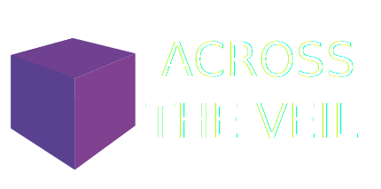

 

we went interstellar, the empire of humanity spanned 250 stars, before the gods punished us by splitting us from the rest of the Core - humanity's abode, full of technological wonders. until a hundred-star long void full of nothing appeared. that's what our radars, sensors, and our eyes told us - until a spinavi-drive beyond safe-power broke it, and we entered **the Veil**.

A fork of Space Station 14 that runs on [Robust Toolbox](https://github.com/space-wizards/RobustToolbox), our homegrown engine written in C#.

## Links

[Discord](https://discord.gg/vbst9JyqY3) / [Website](https://is-going-to.cyou)
